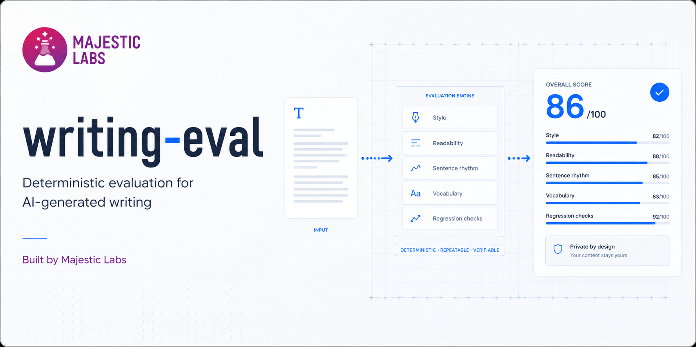

[](https://majesticlabs.dev/?utm_source=github&utm_medium=readme&utm_campaign=writing-eval)

# writing-eval

Built by [David Paluy](https://github.com/dpaluy) from [Majestic Labs](https://majesticlabs.dev/?utm_source=github&utm_medium=readme&utm_campaign=writing-eval).

`writing-eval` gives teams a repeatable way to measure a draft against a chosen
editorial voice. Build a reusable style profile from reference prose, check a
draft against it, and get specific evidence about differences in clarity,
readability, sentence rhythm, vocabulary, and detected writing patterns.

The project also includes a corpus evaluation pipeline for comparing generated
outputs with a reference corpus. Use it for local diagnostics, regression
checks, and repeatable comparisons between writing systems.

Everything runs locally on the CPU and produces deterministic results. The tool
does not call hosted models, upload source material, train models, optimize
detectors, or reproduce a proprietary evaluation method.

## Installation

Python 3.11 or newer and `uv` are required.

```bash
uv sync
```

The release version is the `[project].version` value in `pyproject.toml`. Update
this value for every release. To show the installed release version, run:

```bash
./writing-eval --version
```

## Quick start

Build a style profile from a directory of an author's posts, then check a draft
against it:

```bash
./writing-eval profile build acme --from posts/acme
./writing-eval check draft.md --style acme
```

The first command ingests the `.md` and `.txt` files under `posts/acme` and
writes a reusable profile named `acme` into `data/profiles/acme/`. The second
audits `draft.md` and produces a scored, profile-relative assessment. The
human-readable report shows four section scores, actionable issues with current
and target values, editing instructions, success criteria, source locations,
and general statistics. The profile name is kept out of the report body; it
remains in JSON metadata for reproducibility.

## Use with LLM agents

The repository includes an agent skill at
[`skills/writing-eval/SKILL.md`](skills/writing-eval/SKILL.md). Agent harnesses
that support `SKILL.md` instructions can load it to select the correct command,
build or choose a profile, interpret exit codes and JSON, protect private source
material, and report results without overstating the heuristic score.

The skill controls the local CLI and does not bundle the executable. Use it from
a repository checkout after running `uv sync`.

Example requests:

```text
Use writing-eval to check docs/draft.md against the acme profile. Summarize the
highest-priority issues with their source locations.
```

```text
Build a writing-eval profile named product-docs from the authorized prose in
data/product-docs, then check docs/new-guide.md against it.
```

```text
Compare the writing systems in runs/release-candidate against
data/reference-corpus.jsonl and explain the report verdict.
```

## What it includes

| Capability | Use it for |
|---|---|
| Style profiles | Build a reusable baseline from approved prose |
| Draft checks | Compare one Markdown or plain-text file with a profile |
| Rule-based linting | Locate configurable writing tendencies |
| Corpus evaluation | Compare several output systems consistently |
| Markdown and JSON reports | Support human review, automation, and regression gates |

## Why we built this

AI-generated writing is easy to demo and difficult to evaluate consistently. A draft
can be grammatically correct while still missing an organization's voice,
preferred structure, or editorial constraints.

`writing-eval` turns those expectations into a local, versioned measurement
process. Teams can run the same checks after changing a prompt, model, reference
corpus, or rule set and see what improved or regressed.

This project is one narrow example of a broader Majestic Labs principle: an AI
workflow needs a company-controlled definition of acceptable work. Read
[Building Private AI Evals](https://majesticlabs.dev/blog/202607/building-private-ai-evals?utm_source=github&utm_medium=readme&utm_campaign=writing-eval)
for the broader approach.

## Documentation

- [Use with LLM agents](#use-with-llm-agents)
- [Single-document checks](#single-document-check)
- [Style profiles](#style-profiles)
- [Metrics](#metrics)
- [Corpus evaluation and benchmark](#corpus-evaluation-and-benchmark)
- [Limitations](#limitations)
- [License and contributions](#license-and-contributions)
- [Managed hosting](#managed-hosting)
- [About Majestic Labs](#about-majestic-labs)

## Single-document check

`./writing-eval check` audits one draft the way a linter audits one source file,
without any JSONL wrapping. It takes a Markdown or plain-text file, or `-` to
read from standard input.

```bash
./writing-eval check draft.md
./writing-eval check draft.md --references data/reference-corpus.jsonl
cat draft.md | ./writing-eval check -
```

Options:

- `--rules` selects the rule file (default: the builtin rule set that ships with
  the package). The repository also ships an optional overlay with extra
  AI-writing tells; see [The anti-ai overlay](#the-anti-ai-overlay).
- `--references` is an optional JSONL reference corpus. When omitted, the token
  1-gram L2 metric is skipped, rendered as `n/a`, and a note is printed to
  standard error.
- `--style` compares the draft against a named style profile and renders a
  scored assessment (see [Style profiles](#style-profiles)). It is mutually
  exclusive with `--references`; passing both is a usage error.
- `--profiles-root` locates profiles for `--style` (default `data/profiles`).
- `--format text|json` selects human-readable text or JSON on standard output
  (default `text`).
- `--json PATH` writes the same JSON result to a file while preserving the
  selected standard-output format.

Without `--style`, text output retains the linter format: one finding per line,
sorted by position, using 1-indexed line and column offsets computed from the
real character positions of each match, followed by a metrics block:

```
draft.md:1:1 [warn] metadiscourse_openers: Remove the metadiscourse opener and state the point directly. | span: In this article,
draft.md:1:21 [warn] polish_vocab: Replace overused polish vocabulary with specific language. | span: delve
metrics:
  word_count: 15
  tell_rates_by_severity:
    warn: 400.000000
  mean_sentence_length: 7.500000
  sentence_length_variance: 2.250000
  repeated_opening_rate: 0.000000
  token_1gram_l2: n/a
quality_metrics (informational):
  flesch_reading_ease: 52.000000
  flesch_kincaid_grade: 9.000000
  mtld: 14.000000
  paragraph_stats:
    paragraph_count: 1.000000
    mean_paragraph_sentence_count: 2.000000
    single_sentence_paragraph_rate: 0.000000
```

The example values are illustrative. Scores below 10 tokens render `mtld` as
`n/a`, and text without a sentence renders the readability scores as `n/a`.
With `--style`, text output uses the scored assessment described in
[Check a draft against a profile](#check-a-draft-against-a-profile).

Exit codes distinguish completed checks from input errors:

- `0`: the check completed, with or without findings.
- `1`: a usage or input error (missing file, unreadable rules, invalid JSONL).

## Style profiles

A *style profile* is a deterministic fingerprint of one author's writing, built
from a corpus of their prose. Build a profile once, then check any draft against
it to see how far the draft sits from that voice and which vocabulary and
structure differ. The author's own voice is just one profile among many.

### Build a profile

```bash
./writing-eval profile build <name> --from <dir-or-files...> [--profiles-root data/profiles]
```

`--from` accepts directories (their `.md` and `.txt` files are ingested
recursively) or individual files. A leading YAML frontmatter block is stripped
from each source, and each document becomes one reference record with a stable
ID derived from its filename. The command writes two files into
`<profiles-root>/<name>/`:

- `references.jsonl`: one `{"id", "text", "file"}` record per source document,
  reused as the reference corpus by `check --style`.
- `profile.json`: the profile name, its creation date, a numeric
  `metrics_version` field, per-source word counts, the total word count, and
  the corpus statistics (mean sentence length and variance, repeated-opening
  rate, Flesch reading ease and grade, MTLD, paragraph statistics, and the top
  20 content tokens after a small stop list).

`metrics_version` pins the metric semantics the stored statistics were computed
with. When a release changes those semantics, older profiles are rejected with
a rebuild instruction until `profile build` runs again with the current tool.

For example, put all articles for one author under a dedicated directory:

```text
posts/acme/
├── choosing-a-market.md
├── distribution-first.md
├── founder-notes.txt
└── archive/
    └── early-lessons.md
```

Then build the profile from the directory:

```bash
./writing-eval profile build acme --from posts/acme
```

The directory is scanned recursively, so this imports all four `.md` and `.txt`
articles, including `archive/early-lessons.md`. There is no need to write a
wildcard or list every file. A successful build reports the number of imported
sources and words, for example:

```text
built profile 'acme': 30 sources, 15742 words -> data/profiles/acme
```

To import selected articles instead, list each file after `--from`:

```bash
./writing-eval profile build acme --from \
  posts/acme/choosing-a-market.md \
  posts/acme/distribution-first.md
```

### Recommended corpus size

The command accepts a single non-empty article, but a small profile makes the
score depend on which articles you happened to include. For a profile used as a
style baseline, use **at least 25 articles, and prefer 40 or more**.

That number is measured, not assumed. Holding a draft fixed and varying only
which articles form the profile, the standard deviation of the resulting score
falls with more articles. Two points is the rubric's smallest unit, the
deduction for one excess `warn` occurrence, so below that threshold the
sampling noise is smaller than anything the score can express. The mean
standard deviation crosses 2 points around N = 20, but individual drafts vary
widely, so the number that matters is coverage: the share of drafts that have
actually settled below 2 points at a given profile size.

| Articles in profile | Drafts at or under 2 points of noise |
|---:|---:|
| 10 | 33.3% |
| 15 | 37.5% |
| 20 | 54.2% |
| 25 | 70.8% |
| 30 | 66.7% |
| 40 | 87.5% |
| 50 | 95.8% |
| 60 | 95.8% |

25 articles covers 7 in 10 drafts. 30 articles is not reliably better than 25;
the difference sits inside trial noise. 40 articles covers 9 in 10, and 50
covers 24 in 25, which is why 40 is the preferred target. As a rule that holds
at every corpus size tested: treat a score difference under 3 points as noise,
whether between two drafts or between two runs of the same draft.

**Article count drives stability, not word count.** At a fixed word budget, a
profile built from more, shorter articles is consistently more stable than one
built from fewer, longer articles. At 40,000 words, 28 articles gave a standard
deviation of 1.3 while 11 articles gave 2.5. Prior versions of this document
recommended a 15,000-word minimum; that figure was not supported by measurement
and has been removed. At a fixed article count, per-article length still
matters up to a point: a corpus averaging about 1,200 words per article was
roughly 0.4 points noisier than one averaging about 2,350, with no further gain
past about 2,350 words per article. The floor below 517 words per article, the
shortest article in the study corpus, is unmeasured.

Method, full results, and the reproduction script are in
[docs/profile-size-study.md](docs/profile-size-study.md). The study used one
101-article corpus of long-form nonfiction by a single author. The direction of
the effect should hold generally; the exact crossover point may move for other
genres and article lengths. Run the script on your own corpus to check.

Prefer articles from the same author and the kinds of writing the profile
should represent; mixing unrelated authors, genres, or registers creates a
blended profile.

### Update a profile

There is no incremental append command. Keep the article directory as the
authoritative corpus, add the new article to it, and rebuild using the same
profile name:

```text
posts/acme/new-article.md
```

```bash
./writing-eval profile build acme --from posts/acme
```

Rebuilding replaces `data/profiles/acme/references.jsonl` and
`data/profiles/acme/profile.json` with results computed from every article
currently in `posts/acme`. Always pass the complete corpus when rebuilding.
Passing only `posts/acme/new-article.md` would replace the profile with a
one-article profile rather than add that article to the existing profile.

### List profiles

```bash
./writing-eval profile list [--profiles-root data/profiles]
```

One line per profile: name, source count, and total words.

### Profile cache

`profile build` precomputes reference statistics into `<profile>/cache/`.
After a rule change, refresh that cache with
`writing-eval profile cache <name> [--rules PATH]`. Caches also invalidate
automatically when detector or tokenizer code changes in a new release, since
each entry records a digest of that code. Checks remain correct with a stale
or missing cache; they only get slower until the cache is rebuilt.

### Check a draft against a profile

```bash
./writing-eval check draft.md --style <name> [--profiles-root data/profiles]
```

`--style` resolves the profile's `references.jsonl` as the reference corpus, so
it is mutually exclusive with `--references`. The default text report is
Markdown-shaped so both a person and an LLM can use it directly:

```markdown
# Writing Evaluation

File: `draft.md`

## Article score (heuristic)

**86/100 - Moderate alignment**

This score measures detected style patterns and alignment with the target
profile. It does not measure factual accuracy or overall content quality.

| Section | Score |
|---|---:|
| Clarity and directness | 25/25 |
| Readability | 23/25 |
| Rhythm and structure | 13/25 |
| Vocabulary and style | 25/25 |
| **Total** | **86/100** |

## Issues to improve

### 1. Sentence rhythm differs from the target profile.

- Section: Rhythm and structure
- Priority: High
- Deduction: -8 points

| Measure | Article | Target profile | Direction |
|---|---:|---:|---|
| Average sentence length | 8.1 words | 16.0 words | increase |
| Sentence-length variance | 29.3 | 104.8 | increase |

Editing instruction:

Combine selected explanatory sentences and adjust the mixture of short, medium,
and long sentences toward the target profile. Preserve deliberate emphasis; do
not mechanically force every sentence to the target.

Success criteria:

- Move average sentence length closer to the target.
- Move sentence-length variation closer to the target.
- Preserve short or long sentences that serve a clear rhetorical purpose.

## General statistics

| Statistic | Article | Target profile | Interpretation |
|---|---:|---:|---|
| Word count | 485 | n/a | informational |
| Average sentence length | 8.1 words | 16.0 words | shorter than target |
| Repeated openings | 18.5% | 8.2% | higher than target |
| Reading ease | 59.8 | 60.8 | closely aligned |
```

The example is abbreviated. Each issue includes stable identifiers in JSON,
numeric current and target values, an editing direction, an instruction,
success criteria, and any known line and column locations. Consecutive
repeated-opening findings are grouped into one run, so deliberate anaphora can
be reviewed as a pattern instead of as several disconnected warnings.

Raw rule findings remain in JSON. For a profile check, each rule is also run
over the profile references. The profile occurrence rate is scaled to the draft
length and rounded up to an allowance. Only occurrences above that allowance
appear as rule issues. This lets an author's demonstrated
style outrank a generic rule while keeping the evidence visible.

Excess `warn` findings appear under **Issues to improve** and can lower the
score. Excess `info` findings appear separately under **Review
candidates** and never lower it. There is no strengths section. If the draft has
no scorable prose sentence, the report is explicitly `Unscored` instead of
assigning a misleading number.

#### JSON for LLMs and automation

Print JSON to standard output:

```bash
./writing-eval check draft.md --style acme --format json
```

Keep the human report on standard output and write the same JSON payload to a
file:

```bash
./writing-eval check draft.md --style acme --json evaluation.json
```

Profile checks preserve the raw `file`, `findings`, `metrics`,
`quality_metrics`, and `style_gap` fields and add an `assessment` object. This
abbreviated example shows the shape:

```json
{
  "assessment": {
    "schema_version": 2,
    "rubric_version": "profile-alignment-v2",
    "basis": "rules_and_target_profile",
    "status": "scored",
    "profile": {
      "id": "acme"
    },
    "score": {
      "total": 86,
      "maximum": 100,
      "label": "Moderate alignment",
      "sections": [
        {
          "id": "clarity_directness",
          "label": "Clarity and directness",
          "score": 25,
          "maximum": 25,
          "deduction": 0
        },
        {
          "id": "readability",
          "label": "Readability",
          "score": 23,
          "maximum": 25,
          "deduction": 2
        },
        {
          "id": "rhythm_structure",
          "label": "Rhythm and structure",
          "score": 13,
          "maximum": 25,
          "deduction": 12
        },
        {
          "id": "vocabulary_style",
          "label": "Vocabulary and style",
          "score": 25,
          "maximum": 25,
          "deduction": 0
        }
      ]
    },
    "issues": [
      {
        "id": "sentence_rhythm",
        "kind": "improvement",
        "section": "rhythm_structure",
        "priority": "high",
        "deduction": 8,
        "summary": "Sentence rhythm differs from the target profile.",
        "comparisons": [
          {
            "metric": "mean_sentence_length",
            "label": "Average sentence length",
            "current": 8.137931,
            "target": 16.031049,
            "delta": -7.893118,
            "direction": "increase",
            "unit": "words_per_sentence"
          }
        ],
        "instruction": "Combine selected explanatory sentences while preserving deliberate emphasis.",
        "success_criteria": [
          "Move average sentence length closer to the target."
        ],
        "locations": []
      }
    ],
    "statistics": [
      {
        "id": "word_count",
        "label": "Word count",
        "value": 485,
        "unit": "words",
        "target": null,
        "interpretation": "informational"
      }
    ]
  }
}
```

JSON numbers retain full precision. The profile ID stays in JSON for
reproducibility but is rendered only as `Target profile` in the human report.
The unscored form uses `status: "unscored"`, a `reason`, null total, label, and
section scores, an empty issue list, and the available statistics. The
assessment's `rule_baseline` object records the profile and draft word counts and
one sorted entry per observed rule: profile count, profile rate per 1,000 words,
scaled draft allowance, raw draft count, and excess count.

#### Scoring rubric

The `profile-alignment-v2` rubric starts four sections at 25 points. Version 2
adds profile-relative rule allowances; direct library callers that omit rule
baseline data retain the version 1 contract.

- **Clarity and directness**: directness-related rule findings.
- **Readability**: Flesch reading ease and Flesch-Kincaid grade relative to the
  profile.
- **Rhythm and structure**: sentence length, sentence-length variance, and
  repeated openings relative to the profile.
- **Vocabulary and style**: all other style rules.

Rule deductions are 2 points per excess `warn` occurrence and 0 per `info`
occurrence. An excess occurrence is one above the
allowance derived from the selected profile's aggregate rate. A rule absent from
the profile has an allowance of zero. A rule is assigned to exactly one section,
and repeated openings are scored only in rhythm and structure to prevent
double-counting. Section deductions are capped at 25.

Profile-relative metric deductions use a tolerance before any points are
removed, then increase linearly to a cap:

| Metric | Tolerance | Gap at maximum deduction | Maximum deduction |
|---|---:|---:|---:|
| Reading ease | 5 points | 30 points | 6 |
| Reading grade | 1 grade | 4 grades | 6 |
| Average sentence length | 15% | 100% | 8 |
| Sentence-length variance | 25% | 100% | 7 |
| Repeated-opening rate | 3 percentage points | 20 percentage points | 10 |

For sentence length and variance, the relative gap is
`abs(article - target) / max(abs(target), 1)`. Other rows use the absolute gap.
At or below the tolerance, the deduction is zero. Above it, the unrounded
deduction is:

```text
maximum × (min(gap, cap) - tolerance) / (cap - tolerance)
```

Each issue deduction is rounded half up to an integer before the section cap is
applied. The displayed arithmetic is invariant:

```text
sum(issue deductions)
  = sum(section deductions)
  = 100 - total score
```

Score labels describe alignment, not universal quality:

| Total | Label |
|---:|---|
| 90-100 | High alignment |
| 75-89 | Moderate alignment |
| 60-74 | Low alignment |
| 0-59 | Very low alignment |

MTLD, token 1-gram L2, overrepresented terms, and paragraph statistics remain
informational. The MTLD comparison is especially sensitive to comparing one
draft with an aggregated profile corpus, so it does not affect the score.

### Privacy

`writing-eval` runs locally and does not send drafts, references, or profiles to
a hosted service. Profiles are stored under the git-ignored `data/` directory
by default.

Only use prose that you are permitted to process. Profiles built from
third-party published content should remain private and must not be committed
or quoted at length in tracked files.

## Metrics

- **Tell rate by severity**: style findings in a severity group per 1,000 output words. Lower values indicate fewer detected tendencies.
- **Token 1-gram L2**: Euclidean distance between normalized output and reference token frequency vectors. Lower values indicate closer vocabulary distributions.
- **Overrepresented terms**: tokens whose output frequency most exceeds their reference frequency. Counts or rates explain the ranking.
- **Shared tokenization**: lowercase word tokens keep ASCII and curly-apostrophe contractions together.
- **Mean sentence length**: average number of words per sentence.
- **Sentence length variance**: population variance of sentence word counts. It describes how much sentence lengths vary within the corpus.
- **Repeated opening rate**: share of adjacent sentence pairs that begin with the same normalized opening. The denominator is the number of adjacent sentence pairs, or zero when fewer than two sentences exist.

### Quality metrics (informational)

The metrics below broaden the set toward general readability and structure. They
appear in reports and `check` output and never enter the corpus benchmark's
decision gate or any pre-registered threshold. In a profile check, reading ease
and reading grade contribute only to the versioned heuristic alignment score
described above; MTLD and paragraph statistics remain informational.

- **Flesch reading ease** and **Flesch-Kincaid grade**: standard readability
  scores from word, sentence, and syllable counts. Syllable counts use a
  vowel-group heuristic with silent terminal `-e`, `-es`, and `-ed`
  adjustments, not a dictionary, so individual word estimates can be wrong.
  Reported as `n/a` when the text has no sentence.
- **MTLD**: Measure of Textual Lexical Diversity, the mean length of word runs
  that keep a type-token ratio above 0.72, averaged over forward and backward
  passes. Higher means more varied vocabulary. Reported as `n/a` below 10 tokens,
  where the measure is unreliable.
- **Paragraph statistics**: markdown-aware paragraph count, mean sentences per
  paragraph, and single-sentence paragraph rate. Paragraphs are blank-line
  separated and headings are excluded, so results depend on the input's markdown
  formatting.

Reports retain the aggregate `tell_rate` metric and also emit normalized
`tell_rates_by_severity` values. Repeated-opening corpus rates count only
adjacent pairs within each document, so reordering JSONL records does not alter
the result.

These metrics describe observable text patterns. They do not establish factual
accuracy, originality, reader preference, or overall writing quality on their
own.

## Corpus evaluation and benchmark

This is the original evaluation pipeline, kept for regression checks and the pre-registered benchmark.

Benchmark corpus generation and revision use the external OpenAI Codex CLI
through `benchmark/generate_runs.py`. The Codex executable and its
authentication are optional benchmark dependencies. They are not required for
the `writing-eval` CLI, evaluation of existing output files, or
`scripts/dry_run.sh`.

### CLI usage

Run a corpus evaluation with your own output and reference files:

```bash
uv run python scripts/run_eval.py --outputs path/to/outputs --references path/to/references.jsonl --report /tmp/writing-eval-report.md
```

The command reads each output JSONL file, evaluates its text, compares it with the reference corpus, and writes a Markdown report to the requested path.

The optional `--json` path writes the same report data as JSON. Both formats
include provenance for the reference corpus and style rule set: source paths,
record or rule counts, content SHA-256 hashes, and the rule-set version.

For a checked repository run against test fixtures, use:

```bash
scripts/dry_run.sh
```

The corpus evaluation is also available as the `eval` subcommand
(`./writing-eval eval --outputs ... --references ... --report ...`). The flat
invocation shown above is kept for backward compatibility and routes to the same
behavior.

Revision runs also record a `literal_preservation` result per output in their
metadata. The decision-gate report summarizes the same comparison as an
informational diagnostic. It checks normalized double-quoted spans, URLs, dates,
and numeric literals for additions or removals. Quote whitespace is collapsed,
URL terminal punctuation is ignored, date case and commas are normalized, and
numeric grouping commas are ignored. It does not change any registered criterion
or the gate verdict.

### JSONL schemas

Each JSONL file contains one JSON object per line. IDs must be nonempty, stable,
and unique within a file. A reference file may use a different ID namespace
than the outputs. All output files in one run must contain the same ID set.

#### Prompts

```json
{"id":"prompt-001","use_case":"article_section","prompt":"Explain why clear release notes reduce support work."}
```

Required fields:

- `id`: stable prompt identifier
- `use_case`: `article_section`, `product_writing`, or `exec_communication`
- `prompt`: writing assignment text

#### References

```json
{"id":"ref-001","text":"Clear release notes help customers understand what changed and what to do next. That context prevents avoidable support requests."}
```

Required fields:

- `id`: stable reference identifier aligned to a prompt by numeric suffix
- `text`: accepted reference prose

#### Outputs

```json
{"id":"prompt-001","text":"Good release notes explain the change and its effect. Customers can act without opening a support ticket."}
```

Required fields:

- `id`: prompt identifier
- `text`: generated prose to evaluate

Each file in the directory passed to `--outputs` represents one system. Output files must contain the same prompt ID set so system comparisons stay consistent.

### Rule schema

Style rules live in YAML. Each rule has these fields:

| Field | Meaning |
| --- | --- |
| `id` | Stable, unique identifier used in findings and reports. |
| `severity` | Finding category used to group and normalize tell rates. |
| `detector` | Regex configuration or named detector that identifies the tendency. |
| `message` | Clear diagnostic text shown when the rule matches. |
| `exceptions` | Explicit cases the detector should ignore. An exception suppresses a match only when it overlaps the matched span (case-insensitive, whole words or phrases), not when it appears elsewhere on the same line. Use an empty list when none apply. |
| `enabled` | Merge-time directive, valid only in an overlay. `enabled: false` removes the named rule from the effective set. It is not a field of a loaded rule. |

`id`, `severity`, `detector`, and `message` are required when you define a brand-new
rule id. When you override an existing rule id in an overlay, supply only the fields
you want to change.

Rules are validated when loaded, after any overlay merge. Missing fields, unsupported detectors, and malformed definitions should fail with a clear error.

#### The builtin rule set

One rule set ships with the project, at a single in-package path. It holds 34
rules: 16 `warn` and 18 `info`. The builtin rules are recommendations, and no
rule blocks the build. Both `check` and corpus `eval` use it
by default. The `version:` key in the YAML header is a schema version, not a
content version; the reported SHA-256 and rule fingerprint carry content
identity. The regular passive-voice pattern is deliberately precision-first:
it matches a `be` plus regular `-ed` participle only when the participle ends
the sentence or is followed by a likely agent, preposition, or frequency
determiner, so unlisted adjectival participles can pass through undetected.

#### Customizing rules

Point `--rules` at your own YAML file. A file without an `extends` key replaces
the rule set outright. A file with an `extends` key overlays the base set:

```yaml
extends: builtin
rules:
  - id: my_jargon_ban      # new id: appended to the end of the rule set
    severity: warn
    detector: '(?i)\b(?:synergy|ideate)\b'
    message: Use plain language.
  - id: em_dash_ban        # existing id: override only the listed fields
    severity: warn
  - id: passive_voice      # existing id: removed from the effective set
    enabled: false
```

Merge semantics:

- `extends: builtin` resolves through the installed package, so it works from any
  working directory.
- Any other `extends` value is a path resolved against the overlay file's own
  directory, never the current working directory. An overlay can extend another
  overlay, up to a chain depth of 16.
- Ordering is the base order with overrides and removals applied in place, then
  new rules appended in the order they appear in the overlay.
- An override replaces only the fields present in the overlay entry. Unlisted
  fields keep the base values.
- `enabled: false` on an id that is not in the base set is an error, as is a
  duplicate id inside one overlay file.

#### The anti-ai overlay

Use the bundled overlay when a draft needs a stricter pass for reader-facing
AI-writing tells than the builtin set provides, for example when reviewing
machine-assisted copy before publication. Pass it with `--rules`; it extends the
builtin set rather than replacing it:

```bash
./writing-eval check draft.md --rules rules/anti-ai.yaml
```

The command, output format, exit codes, and JSON schema are identical to the
default check; only the finding set grows:

```
draft.md:1:5 [warn] polish_vocab: Replace overused polish vocabulary with specific language. | span: synergy
draft.md:2:1 [info] connector_openers: Replace the formal additive opener with also, and, or a plain sentence start. | span: Furthermore
```

The overlay lives at `rules/anti-ai.yaml` in the repository (outside the
installed package) and begins with `extends: builtin`, so the effective rule set
is the builtin rules plus four appended rules:

- `narrative_cliches`: stock narrative phrases such as "couldn't help but",
  "little did I know", "stumbled upon".
- `significance_markers`: meta commentary that labels a moment instead of
  showing it, such as "that's the part that got me", "let that sink in".
- `generation_artifacts`: placeholder brackets, `utm_source=chatgpt.com` links,
  and model self-reference such as "as an AI language model".
- `connector_openers`: sentence-initial "furthermore", "moreover",
  "additionally".

It also widens six builtin rules (`polish_vocab`, `recap_endings`,
`throat_clearing`, `faux_insight`, `importance_puffery`, and
`collaborative_artifacts`) with further phrases, keeping their severities and
messages.

The overlay combines with every `check` form, including `--style`, `--format
json`, and reading from standard input. The builtin rule set stays the default
everywhere. Because rule fingerprints identify comparable runs, keep the default
rules for corpus evaluation and benchmark comparisons and use the overlay for
single drafts.

## Limitations

- The bundled fixtures are synthetic and intentionally exaggerated to exercise detectors.
- Results are diagnostic only and should support, not replace, editorial review.
- The article score is a heuristic combination of configured style rules and
  target-profile distances. It measures alignment under the documented rubric,
  not factual accuracy, argument strength, originality, or overall article
  quality.
- Corpus metrics are sensitive to sample size, genre, and reference selection.
- Simple token and sentence boundaries can differ from linguistic parsers.
- A rule match identifies a review candidate, not a universal writing error.
- The harness does not evaluate factual accuracy, coverage, or human preference.
- Literal preservation is a normalized multiset comparison, not semantic factuality.
  It can detect a changed number, date, URL, or quoted span but cannot decide
  whether an unprotected claim is true or whether a paraphrase preserves meaning.
- Distributional scores (token 1-gram L2 and the top overrepresented terms) depend heavily on the composition and size of the chosen reference corpus or profile; small profiles make them noisy.
- L2 distance is sensitive to output length, so systems whose word counts differ a lot are not directly comparable on it.
- Benchmark generation uses a frozen decoding config and measured per-metric noise floors (`benchmark/THRESHOLDS.md`); deltas below the documented floor are inconclusive.

## License and contributions

`writing-eval` is source available under the
[Elastic License 2.0](LICENSE). You may use, copy, modify, redistribute, and
self-host the software subject to that license. You may not provide it to third
parties as a hosted or managed service where the service gives users access to
any substantial set of the software's features or functionality.

Copyright 2026 Majestic Labs LLC.

Contributions are welcome. Read [CONTRIBUTING.md](CONTRIBUTING.md) before
submitting a pull request. Contributors retain ownership of their work and must
accept the [Contributor License Agreement](CLA.md), which gives Majestic Labs
the rights needed to keep contributions in the public project and use them in
an official hosted service.

For OEM, hosted-service, or managed-service licensing, contact
[Majestic Labs](https://majesticlabs.dev/ai?utm_source=github&utm_medium=readme&utm_campaign=writing-eval#inquiry).

## Managed hosting

Majestic Labs is considering an official hosted `writing-eval` service for
people and teams that cannot or prefer not to deploy and maintain the tool.
The local CLI remains complete and self-hostable.

If managed hosting would help your team,
[tell us about your workflow](https://majesticlabs.dev/ai?utm_source=github&utm_medium=readme&utm_campaign=writing-eval#inquiry).

## About Majestic Labs

[Majestic Labs](https://majesticlabs.dev/?utm_source=github&utm_medium=readme&utm_campaign=writing-eval)
is a software foundry for operator-built software.

`writing-eval` is part of our
[open-source](https://majesticlabs.dev/open-source?utm_source=github&utm_medium=readme&utm_campaign=writing-eval) projects.

If your team needs to evaluate an AI workflow against company-specific
standards, [start with Majestic AI](https://majesticlabs.dev/ai?utm_source=github&utm_medium=readme&utm_campaign=writing-eval#inquiry).

This project is not a DFT clone or training system. It is a small deterministic harness for writing diagnostics.
